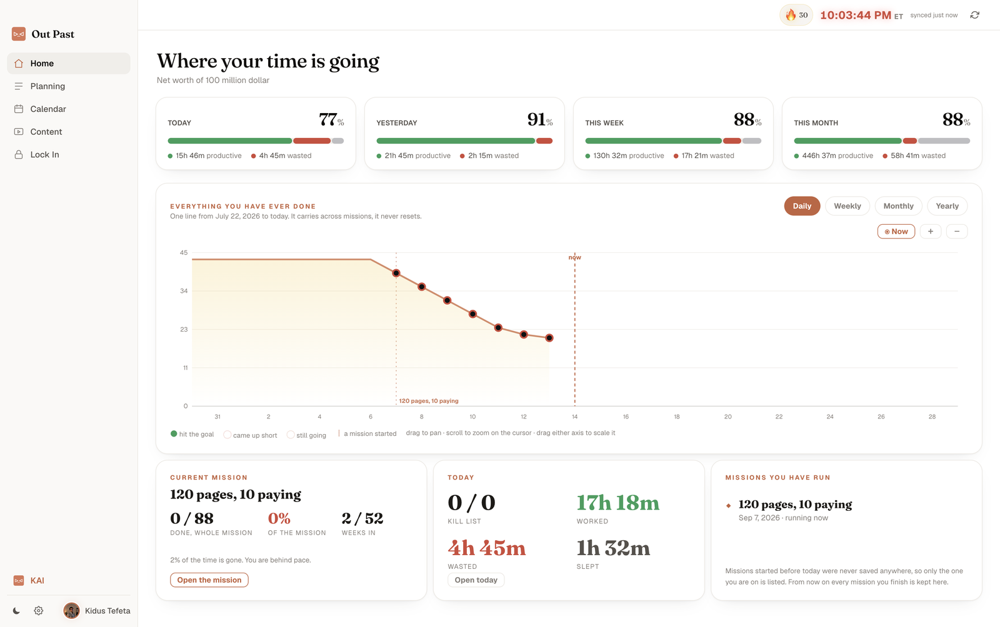
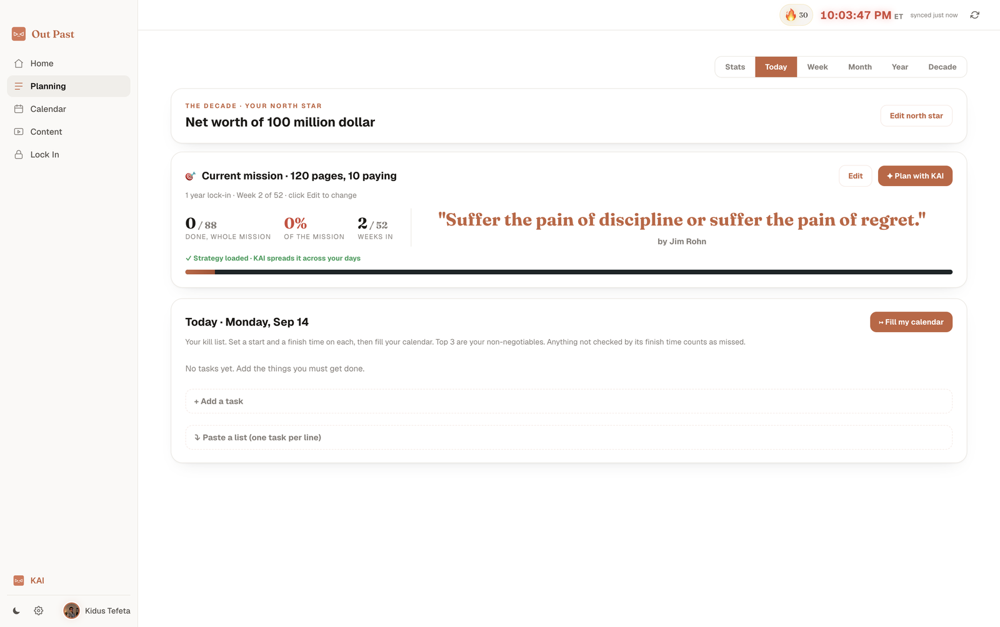
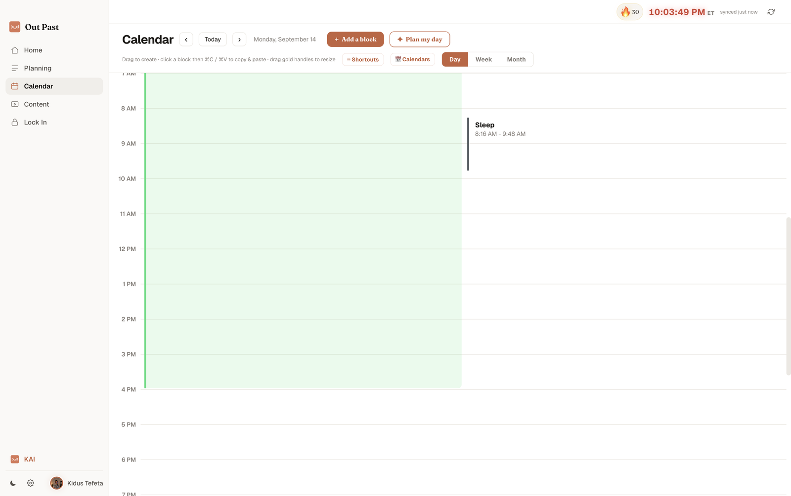
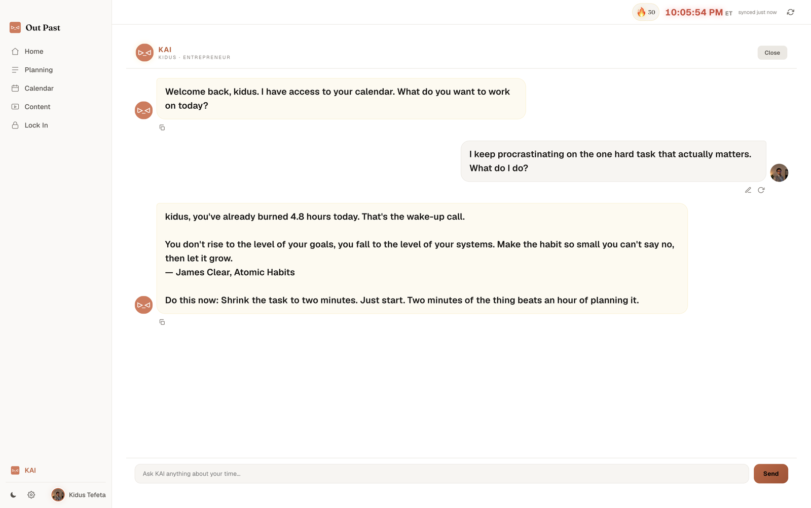

# Out Past

Out Past is a calm, white, Claude-style focus and mission app for **macOS and
Windows**. It pulls your Google Calendars together, shows how much of your day
you actually used versus wasted, helps you set a north star, a mission, and a
daily kill list, and gives you a built-in AI mentor called **KAI**.

Built with Electron + React + Vite. Free, open source, and the AI runs fully on
your own machine.

## Screenshots

**Home — where your time is going**



**Planning — north star, mission, and daily kill list**



**Calendar — a calm, Notion-style day view**



**KAI — your local AI mentor**



## KAI runs entirely on your device

KAI is a fully local AI mentor. It needs no API key, no account, and no internet:

- **Apple Intelligence** through a small bundled Swift helper (`build/afm`) on
  Apple silicon Macs running macOS 26+. Answers are instant and nothing leaves
  the machine.
- **A ~1GB local model via [Ollama](https://ollama.com)** as an offline fallback
  when Apple Intelligence is not available.
- **A local knowledge base** the app builds and reasons over itself, so KAI still
  answers usefully even when neither engine above is ready.

Everything KAI does happens on your Mac.

## What is not included

The blocking / "Lock In" enforcement engine (system-level focus locks and site
blocking) is **intentionally not part of this open source build**. The "Lock In"
tab is present as a placeholder so the rest of the app builds and runs unchanged.

## Windows

Out Past runs on Windows too. The UI, calendar, and KAI all work; the only
difference is the AI engine: there is no Apple Intelligence tier on Windows, so
KAI runs on the **Ollama ~1GB model plus the local knowledge base**. Install
[Ollama](https://ollama.com) and `ollama pull qwen2.5:1.5b` for the full local
mentor; without it KAI still answers from the knowledge base.

Build the Windows installer with `npm run build:win`, or let CI do it: the
included GitHub Actions workflow (`.github/workflows/build.yml`) builds the
`.exe` on a Windows runner. Run it from the Actions tab or by pushing a `v*`
tag, then download the installer from the run's artifacts. The installer is
unsigned, so Windows SmartScreen will warn on first launch (More info -> Run
anyway).

The blocking / Lock In enforcement engine is macOS-only and is not part of this
open build on any platform.

## Requirements

- macOS (Apple silicon recommended for the on-device Apple Intelligence engine)
  or Windows 10/11.
- Node 18+.
- A Google Cloud OAuth **Desktop** client (free) if you want calendar sync — you
  paste your own Client ID / Secret into the app on first run; they are stored
  locally and never bundled.

## Build and run

```bash
npm install

# Dev: Vite dev server + Electron with hot reload
npm run dev

# Build the renderer, then package the Mac app with electron-builder
npm run build

# Or just the unpacked .app (no dmg)
npm run pack
```

### Compiling the Apple Intelligence helper

The bundled binary (`build/afm`) is not committed. On Apple silicon running
macOS 26+, compile it from source before packaging:

```bash
swiftc build/afm.swift -O -target arm64-apple-macos26 -o build/afm
```

If it is missing or you are on an unsupported Mac, KAI simply skips this engine
and falls back to Ollama or the local knowledge base.

### Optional Ollama fallback

```bash
ollama pull qwen2.5:1.5b
```

With Ollama installed and running, KAI uses this ~1GB local model when Apple
Intelligence is unavailable.

## Optional cloud features

The core app and KAI are fully local. A couple of features (cross-device sync and
an optional cloud AI/scheduling worker) can be switched on by bringing your own
endpoints. Copy `.env.example` to `.env` and fill them in:

```bash
cp .env.example .env
```

Left blank, those features quietly disable themselves and everything else keeps
working. See `.env.example` for details.

## License

MIT. See [LICENSE](LICENSE).
